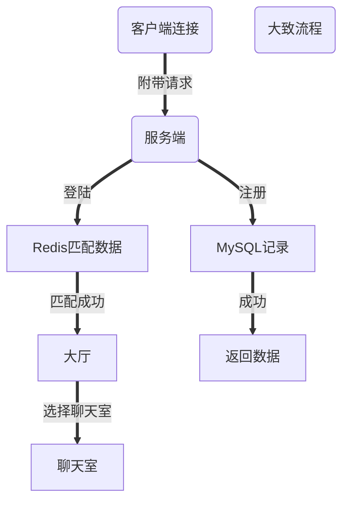
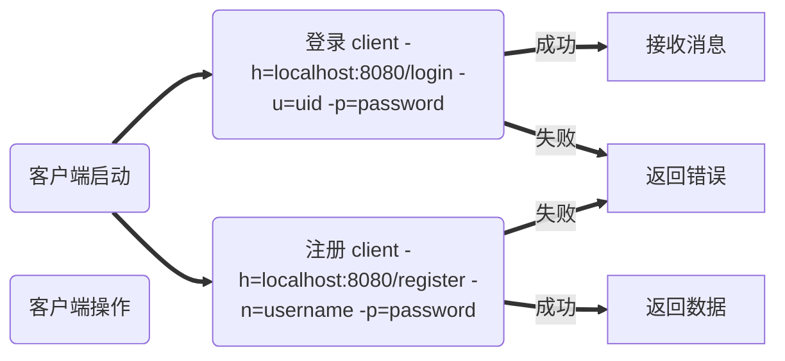
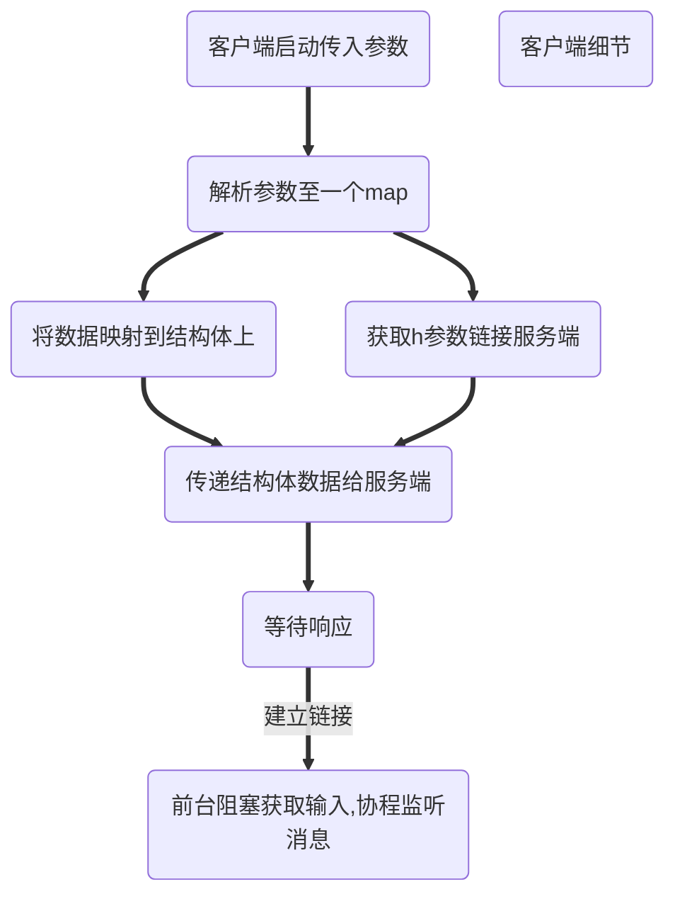
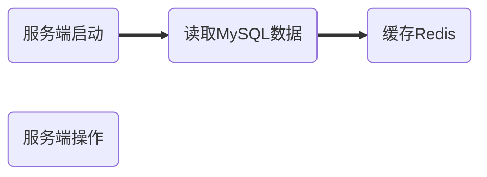

```mermaid
graph TD
title(大致流程)
1(客户端连接)==>|附带请求|2(服务端)==>|登陆|Redis匹配数据==>|匹配成功|大厅==>|选择聊天室|聊天室
2==>|注册|MySQL记录==>|成功|返回数据
```

```mermaid
graph LR
title(客户端操作)
1(客户端启动)==>2(登录 client -h=localhost:8080/login -u=uid -p=password)
1==>3(注册 client -h=localhost:8080/register -n=username -p=password)
2==>|成功|接收消息
2==>|失败|返回错误
3==>|成功|返回数据
3==>|失败|返回错误
```

```mermaid
graph TD
title(客户端细节)
1(客户端启动传入参数)==>2(解析参数至一个map)==>3(获取h参数链接服务端)
2==>4(将数据映射到结构体上)==>5
3==>5(传递结构体数据给服务端)==>6(等待响应)
6==>|建立链接|7(前台阻塞获取输入,协程监听消息)
```

```mermaid
graph LR
title(服务端操作)
1(服务端启动)==>2(读取MySQL数据)==>3(缓存Redis)
```

